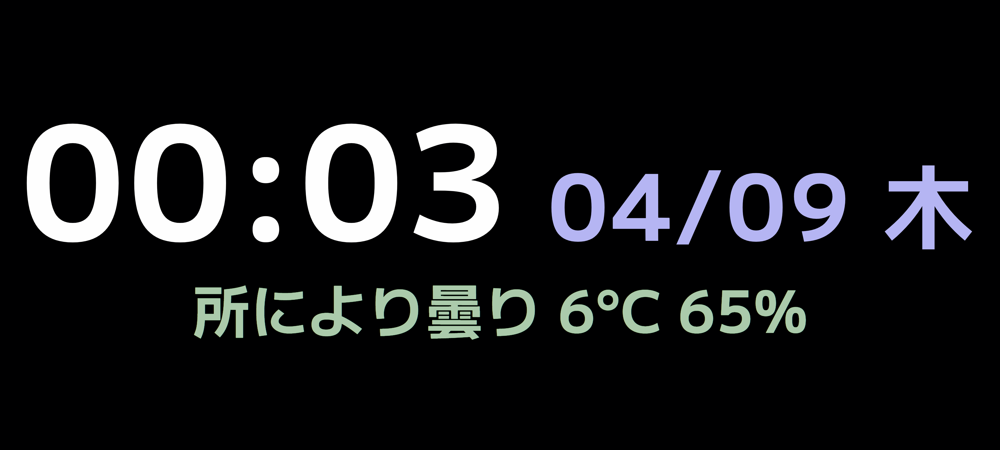

# 仕様

## デバイス仕様
- AQUOS sense4 plus 画面解像度: フルHD+（2400×1080）

## 表示・レイアウト方針
- **想定環境**: AQUOS sense4 plus の横向き（ランドスケープ）表示。
- **解像度非依存の設計**: 端末ごとのDPI設定の差異による影響を防ぐため、ピクセル数への依存は避け **アスペクト比 2400:1080** を基本の比率とする。
- **スケーリング仕様**: 画面全体（2400:1080の領域）に隙間なく目一杯ストレッチしてコンテンツが表示される仕様とする。

## 表示例


# 環境

## 一時ローカルサーバーの起動
```bash
python -m http.server 8000
```

## 一時ローカルサーバーのURL
http://[IP_ADDRESS]:8000

## プロジェクトリポジトリ
https://github.com/nekoryu/clockck

## 恒久的なサーバーのURL
https://nekoryu.github.io/clockck
